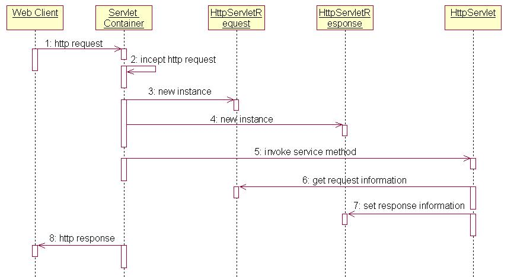

## JavaWEB开发 ##
---
#### 一、准备 ####
* 入门知识

  在开发之前需要安装服务器
  服务器的作用就是：相当于响应客户端的请求返回响应的资源
* 动态网页和静态网页

  并不是指网页是否有动画。静态网页是指内容不会变化
  动态网页是指内容有程序产生并会时时变化
* 具体的Web服务器

  WebLogic、WebSphere、Tomcat

  [Tomcat获取地址](http://jakarta.apache.org)
* Tomcat的目录结构

  webapps  放置的是我们所写的应用程序Servlet

  conf 放置的是Tomcat的配置文件
  可以配置虚拟主机，以及tomcat的端口、管理用户等配置信息
* JavaWEB项目目录结构
```
  -webapps
   -ROOT
     -WEB-INF
        -classes
        -lib
        web.xml
      index.jsp
```
> <font color=red>注意：WEB-INF 目录在外界是无法访问到的。</font>
---
#### 二、HTTP协议 ####
> 什么是HTTP协议：
> HTTP协议用于定义客户端与web服务器通迅的格式。
>
>HTTP是hypertext transfer protocol（超文本传输协议）的简写，它是TCP/IP协议的一个应用层协议，用于定义WEB浏览器与WEB服务器之间交换数据的过程。
>
>客户端连上服务器后，向服务器请求某个web资源，称之为客户端向服务器发送了一个HTTP请求

* 请求

  请求行 GET /test/test.jsp HTTP1.1

  请求消息 描述客户端环境信息以及请求的服务器信息

  请求实体数据

* 响应

  状态行  HTTP/1.1 200 OK

  响应消息

  响应实体数据
---
#### 三、Servlet ####
应用程序的开发过程:
``` html
第一步：实现Servlet接口
第二步：要在WEB-INF目录找web.xml文件
    <servlet>
      <servlet-name>index</servlet-name>
      <servlet-class>com.test.IndexServlet</servlet-class>
      <init-param>
          <param-name>classdebuginfo</param-name>
          <param-value>true</param-value>
      </init-param>
      <load-on-startup>1</load-on-startup>
    </servlet>
    <servlet-mapping>
      <servlet-name>index</servlet-name>
      <url-pattern>/gaoxin</url-pattern>
      <url-pattern>/songjun</url-pattern>
    </servlet-mapping>
第三步：部署项目，相当于放到了webapps目录下面
```
* Servlet生命周期


1. Web Client 向Servlet容器（Tomcat）发出Http请求
2. Servlet容器接收Web Client的请求
3. Servlet容器创建一个HttpRequest对象，将Web Client请求的信息封装到这个对象中。
4. Servlet容器创建一个HttpResponse对象
5. Servlet容器调用HttpServlet对象的service方法，把HttpRequest对象与HttpResponse对象作为参数传给 HttpServlet 对象。
6. HttpServlet调用HttpRequest对象的有关方法，获取Http请求信息。
7. HttpServlet调用HttpResponse对象的有关方法，生成响应数据。
8. Servlet容器把HttpServlet的响应结果传给Web Client。

```
    直接集成Servlet 会产生
    init 在第一次被访问的时候调用
    service 在每一次被访问的时候调用
    destory 在关闭服务器的时候调用
```
我们所写的应用程序要继承HTTPServlet
覆写doGet  doPost
```
    继承关系
    Servlet
    |
    GenericServlet
    |
    HttpServlet
    |
    我们自己写的类
```
